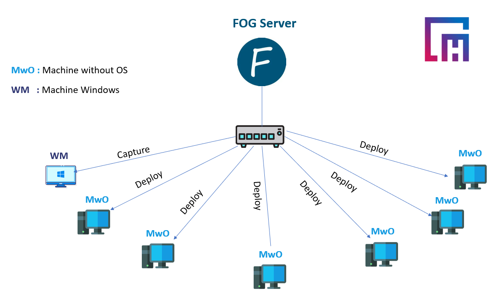
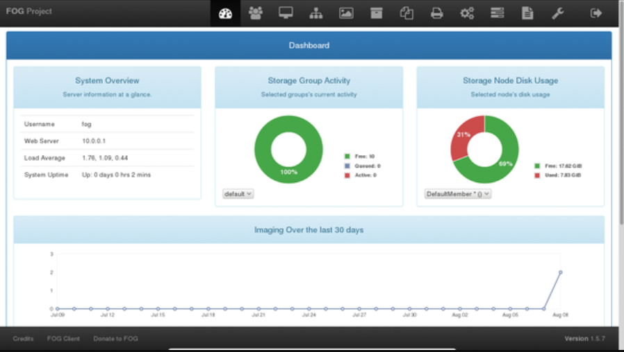
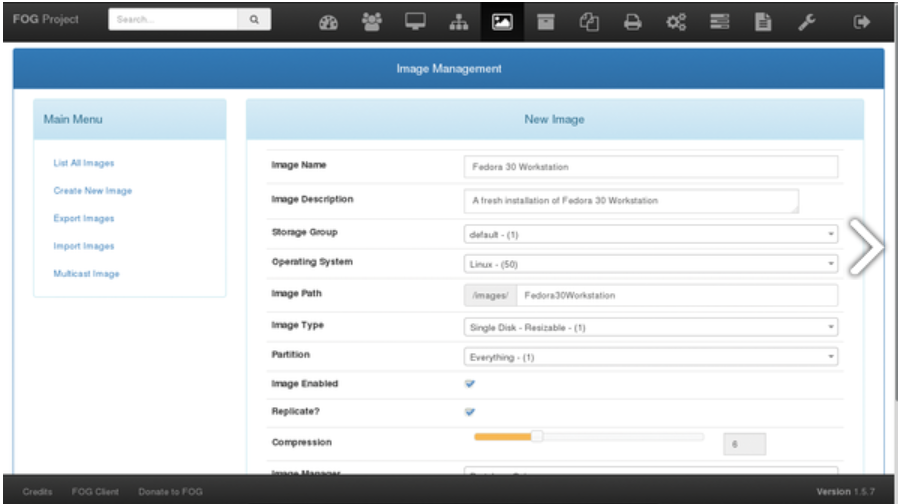
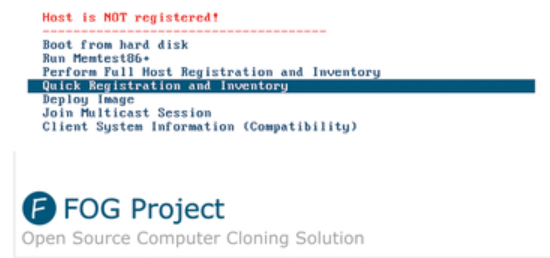
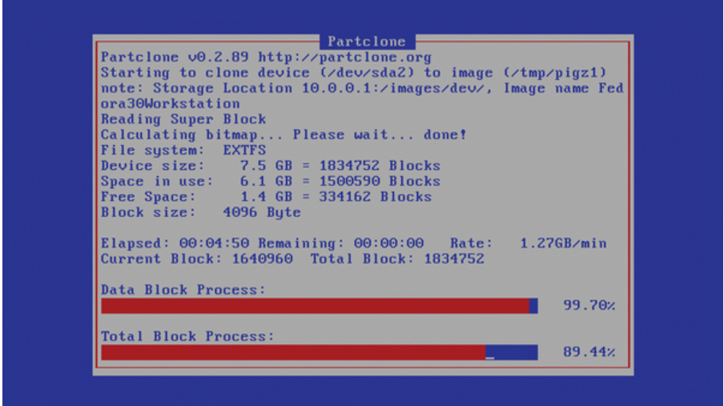

# Fog Project(Cloud Marketing Hub)
Fog project : Managing a network full of computers can sap the energy out of any admin, irrespective of the number of computers in your network. Whether you oversee a lab full of computers at school or the network of a multinational company with offices across the world, you can use the FOG project [1] to manage them with ease.

FOG helps take the pain out of time-consuming and repetitive tasks such as imaging and cloning computers. FOG also makes light of regular administrative tasks such as installing software and can even manage printers on the network. All theatrics aside, FOG's most essential task is to help you image an installation that can then be deployed to other computers on the network.

In My project with **Cloud Marketing Hub Tangier** I make a lab like this :



**1.Download for project :**

first of all you need to have a linux machine (ubuntu) to install fog project
Once you have your network set up, head to the machine that you've earmarked as the FOG server and download the latest stable FOG release from its Git repository with:
```
$ git clone https://github.com/  FOGProject/fogproject.git ~/fogproject
```
Once it's downloaded, change into the directory and fire up the installation script:
```
$ cd fogproject/bin$ sudo ./installfog.s
```
When it's done, the installation script will display a URL for FOG's Dashboard, such as http://10.0.0.1/fog/management . Open the link in your web browser and log in with the default username (fog) and password (password). 
This dashboard will display :



**2.Create a new image**

Now that the imaging server is set up, you can use it to image a computer. Once a computer has been imaged, you can then deploy that image to other computers with a single click. To begin the process, head to Images | Create New Image .



 **3.Registration of windows machine**

Now head to the computer with windows 10 that you wish to use as the base image and boot it up. Since you've set all the computers in your network to boot from the network card, it'll display the PXE boot environment from the FOG server. Scroll down the FOG menu and select the **"Quick Registration"** and Inventory option. The FOG server will now scan the computer and add it to its repository of known hosts.



When it's done, power down the windows computer and head back to the FOG server. Fire up the dashboard and head to **Hosts -> List All Hosts** . You should now see the windows machine listed here, which by default is identified by its MAC address. Click on the edit icon to change it to something more identifiable like windows original . Before saving the changes, make sure you associate an image with this host. Use the Host Image pull-down menu to select the windows Workstation option for the image you created earlier.

 **4.windows image capture**

 Now head to the windows machine and boot it up. It'll again detect FOG's PXE and automatically image the machine and upload a compressed version to the FOG server. The process will take some time depending on the size of the disk it has to image, the processing capabilities of the computers involved, and the speed of the local network. 

 

**5.Deploy Target machines**

Before you can deploy an image to another computer, you need to first register these target computers with the FOG server as well. The registration process for the target machines is the same as the process for registering hosts. Boot the new computer from the network, which should detect FOG's PXE environment, and, when it does, select the **Quick Registration** and Inventory option.

Once a new target computer has been added to FOG's repository of known computers, log in to the FOG dashboard and head to **"Hosts -> List All Hosts** . Just like before, click on the edit icon corresponding to the newly added machine and rename it so that it's more identifiable, something like **VM01** . Most importantly, remember to associate the windows 10 Workstation image with this computer using the Host Image pull-down menu. Repeat the process to register all the computers in the lab with the FOG server. Then edit them in the FOG Dashboard to give them an identifiable name and associate them with the appropriate image such as the Windows 10 Workstation image that was created earlier.

Now to replicate this Windows image onto the target computers, head to **Tasks -> List All Hosts** . Browse the list of hosts to find the entry for the computer to which you wish to deploy and hit the corresponding down arrow image Deploy button . After the deploy task has been created, head to the workstation, and power it on. The computer's PXE environment will automatically detect the task from the FOG server and begin copying the image from the server onto the local machine. Again, it'll take some time to complete, but when it's done, you'll end up with a mirror copy of the Windows 10 Workstation installation on this computer.

### Tools using in my work : ### 

- Ubuntu Machine (Fog Server)
- machine with windows os
- machines without os 
- D.Link switch
- [Fog project Documentation](https://docs.fogproject.org/en/latest/)

### Contact information :
- [Facebook](https://www.facebook.com/profile.php?id=100082569926842)
- [Twitter](https://twitter.com/HamzaAchahboun3)
- [LinkedIn](https://www.linkedin.com/in/achahboune-hamza/)
- [Redit](https://www.reddit.com/user/HamzaVerde)
- [Youtube](https://www.youtube.com/channel/UCVIOkzY9OijnUJ-daoZsXqw)
 
 ### Helpful Tutorial in my youtube Channel
 -[Fog Project](https://www.youtube.com/watch?v=GNk3YhL6oFE&list=PLGm6YTcAxLLAkRAXVk4YPgPzTLsMwzhRS)


